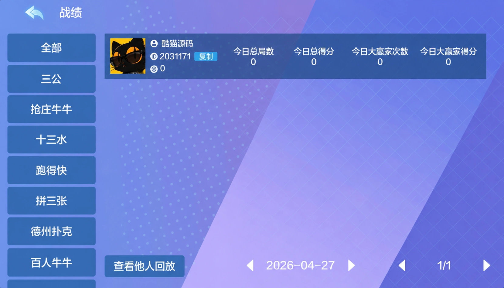

# 多多来了二开有友版 Unity 与 C# 技术介绍

多多来了二开有友版采用 Unity 前端、C# 后端和 MongoDB，客户端面向 Android 与 iOS。项目包含联盟大厅、房间列表、玩法分类和战绩查询，本文介绍技术组成，并提供一个独立的 C# 房间列表筛选示例。

## 技术组成

| 部分 | 技术或平台 |
| --- | --- |
| 客户端 | Unity |
| 服务端 | C# |
| 数据库 | MongoDB |
| 移动端 | Android、iOS |

客户端工程包含场景、脚本、资源和第三方依赖目录。Unity 工程界面使用 2020.3.33f1c2，场景名为 Init。


## 联盟大厅

大厅包含我的联盟、加入联盟和创建联盟入口，配套战绩、消息、活动、公告与玩法页面。城市背景与卡片式入口组成横屏界面，联盟列表和加入、创建操作分别展示。


## 子游戏

以下为部分玩法名单：

| 类别 | 玩法 |
| --- | --- |
| 扑克 | 欢乐三公、抢庄牛牛、开趣十三水、经典跑得快、炸金花、德州扑克、百人牛牛、百家乐、龙虎争斗 |
| 捕鱼 | 千炮捕鱼、李逵捕鱼 |

游戏名称按项目资料保留。

## 房间列表

房间页按玩法分组展示桌位，包含房间名称、局数进度和座位状态，并提供隐藏满座房间与创建房间入口。大厅列表与实际加入操作应分开处理：列表负责展示，加入请求由服务端根据当时的房间状态处理。

例如，一个最多容纳 3 人的房间，在已有 2 人时可以出现在可加入列表中；人数达到 3 人后应从该列表中移除。切换玩法分类时，还要同时匹配房间的玩法标识。

## 战绩查询

战绩页按玩法分类，提供日期切换和分页。统计项包括今日总局数、今日总得分、今日大赢家次数及今日大赢家得分，并带有回放入口。



## C# 房间筛选示例

这是为本文编写的独立教学代码，不是原项目源码。示例从指定玩法中筛选尚未满座的房间，并跳过空记录、缺失标识和无效人数。

```csharp
using System;
using System.Collections.Generic;

public sealed class DemoRoom
{
    public string Id { get; set; }
    public string Game { get; set; }
    public int Players { get; set; }
    public int Capacity { get; set; }
}

public static class DemoRoomFilter
{
    public static List<DemoRoom> FindJoinable(
        IEnumerable<DemoRoom> rooms, string game)
    {
        if (rooms == null) throw new ArgumentNullException("rooms");
        var result = new List<DemoRoom>();
        foreach (var room in rooms)
        {
            if (room == null || string.IsNullOrWhiteSpace(room.Id)) continue;
            if (room.Capacity <= 0 || room.Players < 0) continue;
            if (room.Players >= room.Capacity) continue;
            if (!string.Equals(room.Game, game, StringComparison.Ordinal)) continue;
            result.Add(room);
        }
        return result;
    }
}
```

调用 `DemoRoomFilter.FindJoinable(rooms, "三公")` 可取得对应列表。比如容量为 3、已有 2 人的房间会保留；容量为 3、已有 3 人的房间会被过滤。返回列表沿用输入顺序。

筛选结果是展示时的状态，不是座位预留。多人同时加入时，服务端仍需在同一次受保护的状态更新中检查人数并分配座位，防止最后一个空位被重复分配。

## 技术交流

文档勘误与开发学习交流：Telegram [@root4433](https://t.me/root4433)。

本文用于软件开发学习与非现金娱乐技术交流，不提供生产数据库、账号凭据或完整组件下载，不介绍操控输赢的功能。
